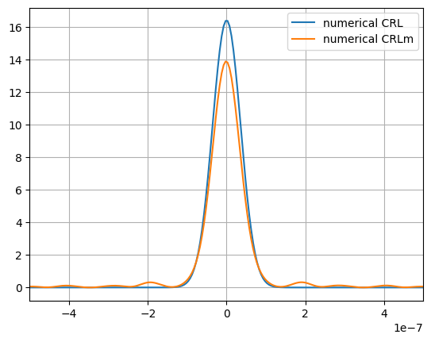

# opticaldevicelib
Представляется вниманию библиотека-код [opticaldevicelib](https://github.com/mamichberdey/Optical_device/blob/main/opticaldevicelib.py), предназначенная для построения оптических схем с использованием рентгеновского излучения.
В схеме могут использоваться: точечный источник с заданной энергией или длиной волны, параболические [CRL линзы](https://en.wikipedia.org/wiki/Compound_refractive_lens) и т.д.
Библиотека предоставляет возможность моделирования нарушения топологии - шероховатость поверхности, сдвиги и повороты элементов.
Также имеется возможность анализа влияния нарушения топологии линзы на излучение.
Были использованы несколько методов для ускорения и оптимизации кода такие как JIT-компиляция и использование FFT на CUDA.

# Апробация
С использованием этой библиотеки была написана [дипломная работа](https://github.com/mamichberdey/Optical_device/blob/main/diploma.pdf) и [презентация](https://github.com/mamichberdey/Optical_device/blob/main/presentation.pdf). Дипломная работа была защищена на отлично, а также является работой победителя в рамках [универсиады "Ломоносов"](https://universiade.msu.ru/file/event/7866/eid7866_attach_9166106f01680b3825bf4aa058b132a589e5d580.pdf).


# Пример реализации

``` python
import opticaldevicelib as od
import numpy as np
import matplotlib.pyplot as plt
od.Optical_device.set_value(new_dx=5e-9, new_N=2**15)
```

Способ инициализации точечного источника c энергией En и распр. ВФ на
расстоянии z от него

``` python
p = od.Point_source(z=100, En=10) 
E_arr = p.E() # полученная воловая функция от точечного источника
```

Пример инициализации пластиковых (C21SO8SiH36) линз (идеальная и
неидеальная)


``` python
 N1_global = 10 # число линз в массиве
 Copy_flag = False # систематический = True / случайный подход = False
 arr_len = 2 if Copy_flag else 2*N1_global

 phases = 2*np.pi*np.random.rand(arr_len) # фазы шероховатости
 w_s = (np.random.rand(arr_len)-0.5)*np.pi/180*1 # повороты относительно центров линз
 s_s  = (np.random.rand(arr_len)-0.5)*2e-6*1 # поперечные сдвиги линз

 crl = od.CRL(lam=p.lam, arr_start=E_arr,\
                 R=5e-6, A=24e-6, d=5e-6, N1=N1_global, z=0,\
                     molecula="C21SO8SiH36", density=1.12, Flen=0, gap=0) # инициализация линзы (идеальный профиль)

 crlm = od.CRLm(lam=p.lam, arr_start=E_arr,\
                     R=5e-6, A=24e-6, d=5e-6, N1=N1_global, z=0,\
                         molecula="C21SO8SiH36", density=1.12, Flen=0, gap=0,\
                             b=1e-6, m=3e6, copy=Copy_flag, arr_phase=phases, arr_s=s_s, arr_w=w_s) # инициализация линзы (шероховатый случайный профиль)
                                
```
Пример инициализации кремниевых (Si) линз (идеальная и неидеальная)

``` python
N1_global = 100 # число линз в массиве
Copy_flag = True # систематический = True / случайный подход = False
arr_len = 2 if Copy_flag else 2*N1_global

phases = 2*np.pi*np.random.rand(arr_len)*0 # фазы шероховатости
w_s = (np.random.rand(arr_len)-0.5)*np.pi/180*0 # повороты относительно центров линз
s_s  = (np.random.rand(arr_len)-0.5)*2e-6*0  # поперечные сдвиги линз

crl = od.CRL(lam=p.lam, arr_start=E_arr,\
                R=6.25e-6, A=50e-6, d=2e-6, N1=N1_global, z=0,\
                    molecula="Si", density=2.33, Flen=0, gap=0) # инициализация линзы (идеальный профиль)

crlm = od.CRLm(lam=p.lam, arr_start=E_arr,\
                    R=6.25e-6, A=50e-6, d=2e-6, N1=N1_global, z=0,\
                        molecula="Si", density=2.33, Flen=0, gap=0,\
                            b=2e-7, m=3e8, copy=Copy_flag, arr_phase=phases, arr_s=s_s, arr_w=w_s) # инициализация линзы (шероховатый случайный профиль)
```

!!!Важно!!! Подсчёт и установка фокусного расстояния для линз

``` python
focus = crl.focus() # подсчет фокуса по аналитической формуле
crl.set_z(z=focus) # установка фокуса
crlm.set_z(z=focus) # установка фокуса
```

Распределение интенсивности излучения в фокусе

``` python
plt.plot(p.x, crl.I(), label="numerical CRL")
plt.plot(p.x, crlm.I(), label="numerical CRLm")
plt.legend()
plt.xlim(-5e-7, 5e-7)
plt.grid()
plt.show()
```

